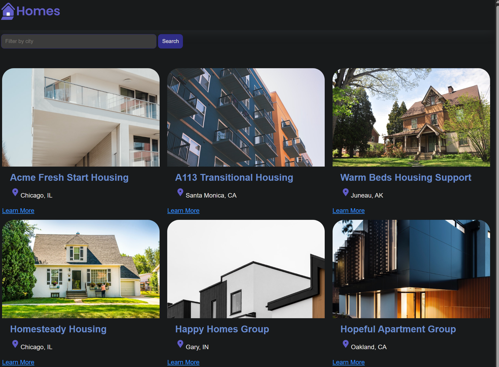

# Angular Homes App

It's for a tutorial from angular doc called [Build your first Angular app](https://angular.dev/tutorials/first-app).

It's a 2-year-old tutorial, but I think the concept is great for building a basic knowledge of how Angular works.

- Install Angular

  `npm install -g @angular/cli`

- Download the source code to local machine from [here](https://github.com/angular/codelabs/tree/homes-app-start).

- Once the code has been downloaded

  `cd House-List-Angular`

- Install the dependencies

  `npm install` 

- Run the application 

  `ng serve`

- Create a new component

  `ng generate component Home --standalone --inline-template`

  In short, we can write:

  `ng g c details --standalone --inline-template`

- Create a new interface

  `ng generate interface housingLocation`

- App data from [here](https://gist.github.com/MarkTechson/efe8a9d4727ef33949b78812e66db082).

- App styles from [here](https://gist.github.com/MarkTechson/fa601fdc856d26b3bfa5030dae147f00).

- Create a new service

  `ng generate service housing`

- Demo

